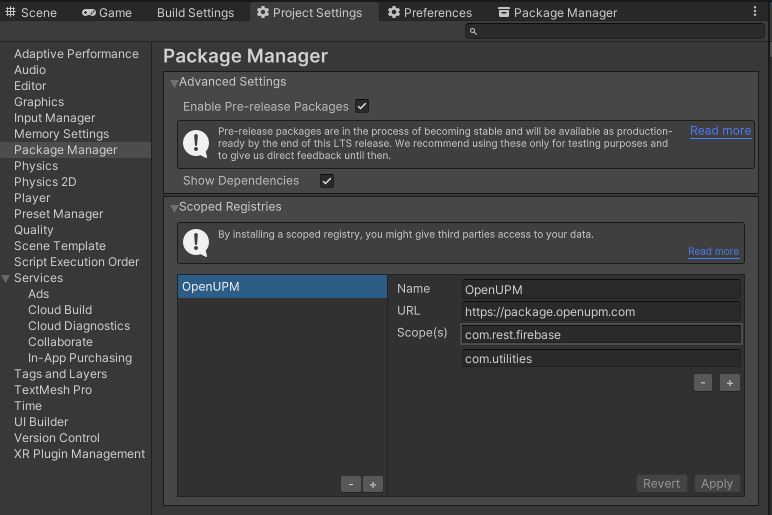

# Firebase.Authentication

[](https://discord.gg/xQgMW9ufN4)
[](https://openupm.com/packages/com.rest.firebase.authentication/)

A non-official [Firebase](https://firebase.google.com/) authentication RESTful client for the [Unity](https://unity.com/) Game Engine.

Based on [FirebaseAuthentication.net](https://github.com/step-up-labs/firebase-authentication-dotnet)

***All copyrights, trademarks, logos, and assets are the property of their respective owners.***

## Installing

### Via Unity Package Manager and OpenUPM

- Open your Unity project settings
- Add the OpenUPM package registry:
  - `Name: OpenUPM`
  - `URL: https://package.openupm.com`
  - `Scope(s):`
    - `com.rest.firebase`



- Open the Unity Package Manager window
- Change the Registry from Unity to `My Registries`
- Add the `Firebase.Authentication` package

### Via Unity Package Manager and Git url

- Open your Unity Package Manager
- Add package from git url: `https://github.com/RageAgainstThePixel/com.rest.firebase.authentication.git#upm`

---

## Documentation

### Project Setup

By default the `FirebaseAuthenticationClient` will attempt to load the `FirebaseConfigurationSettings.asset` scriptable object asset if one exists.

If no `FirebaseConfigurationSettings.asset` can be found then the client will attempt to load te `google-services.json` file in the local project folder.

Last, it will attempt to load the environment variable `FIREBASE_CONFIGURATION` which should point to a `google-services.json` path.

Alternatively, you can also explicitly specify an api key and auth domain when creating the client:

```csharp
var firebaseClient = new FirebaseAuthenticationClient("apiKey", "hello.firebase.com");

FirebaseUser firebaseUser;

try
{
    firebaseUser = await firebaseClient.SignInWithEmailAndPasswordAsync("username", "password");
}
catch (Exception e)
{
    Debug.LogError(e);
    return;
}

Debug.Log($"Signed in as {firebaseUser.Info.DisplayName}");

firebaseClient.SignOut();
```

## Additional Packages

- [Firebase.Storage](https://github.com/RageAgainstThePixel/com.rest.firebase.storage)
- [Firebase.Realtime-Database](https://github.com/RageAgainstThePixel/com.rest.firebase.realtime-database)
